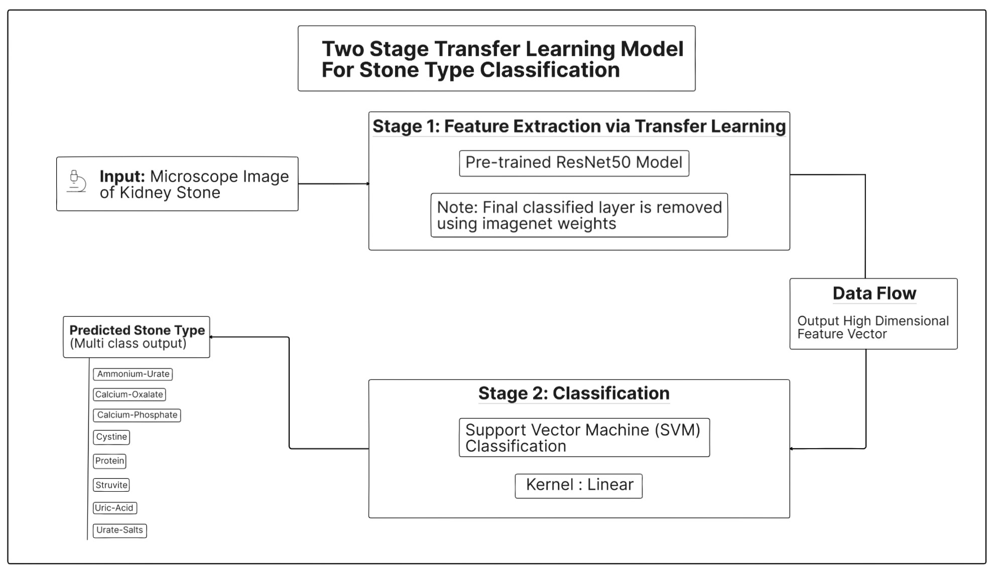

# Project Notes: Kidney Stone Detection and Classification System

## 1. System Architecture and Flow

This project is an application designed to analyze medical images for kidney stones. It consists of a web frontend, a Go backend acting as a reverse proxy, and a Python backend for AI/ML model inference.

### System Flow:

1.  **User Interaction**: The user accesses the web interface served from the `./web` directory. The interface provides two separate forms: one for uploading CT scans to detect kidney stones and another for uploading microscope images of stones to classify their type.

2.  **Frontend (HTML/JS/CSS)**: When the user uploads an image and clicks "Predict" or "Classify", the JavaScript (`script.js`) creates a `POST` request. This request contains the image file and an `expected_type` field ('ct_scan' or 'stone_image') to the `/predict_image` endpoint.

3.  **Go Backend (`main.go`)**: A Go server running on port `8080` serves the static web files. It also acts as a reverse proxy. All requests to its `/predict_image` endpoint are forwarded to the Python API server on `localhost:8000`. This architecture simplifies deployment and avoids Cross-Origin Resource Sharing (CORS) issues.

4.  **Python API Backend (`api.py`)**: A FastAPI server on port `8000` receives the request from the Go proxy.
    *   **Gatekeeper Model**: The API first uses a "gatekeeper" model (`yolo_gatekeeper.pt`) to classify the incoming image as `ct_scan`, `stone_image`, or `other`.
    *   **Validation**: It validates that the type predicted by the gatekeeper matches the `expected_type` sent from the frontend. This prevents, for example, a CT scan from being sent to the stone type classifier.
    *   **Routing**: Based on the validated type, the API routes the image to the appropriate specialized model.
    *   **Inference**: The specialized model performs the prediction (detection or classification).
    *   **Response**: The result is sent back to the Go server, which forwards it to the frontend to be displayed to the user.

---

## 2. AI/ML Models

The system uses three distinct machine learning models.

### 2.1. Kidney Stone Detection (Is a stone present?)

This model determines whether a kidney stone is present in a given CT scan image.

*   **Model File**: `kidney_stone_detection_model.h5`
*   **Training Data**: Images from the `./CT_images/` directory, split into `Train` and `Test` sets, with `Normal` and `Stone` sub-folders.
    *   Training set: 3000 images (2000 Normal, 1000 Stone).
    *   Test set: 900 images (600 Normal, 300 Stone).
*   **Training Process**: Detailed in `Kidney_Stone_Detection.ipynb`.
    *   **Architecture**: A Convolutional Neural Network (CNN) built with Keras/TensorFlow.

        

        *   `Conv2D` (32 filters, 3x3 kernel, ReLU) -> `BatchNormalization` -> `MaxPooling2D`
        *   `Conv2D` (64 filters, 3x3 kernel, ReLU) -> `BatchNormalization` -> `MaxPooling2D`
        *   `Flatten`
        *   `Dense` (128 units, ReLU) -> `BatchNormalization` -> `Dropout` (0.5)
        *   `Dense` (2 units, Sigmoid activation for binary classification).
    *   **Data Preprocessing**: `ImageDataGenerator` is used for real-time data augmentation (rotation, rescale, shear, zoom, flip) to prevent overfitting and improve generalization.
    *   **Training Parameters**:
        *   **Loss Function**: `binary_crossentropy`
        *   **Optimizer**: `adam`
        *   **Epochs**: 50 (with early stopping)
        *   **Batch Size**: 15
    *   **Performance**:
        *   The training history shows the model reaching a high validation accuracy, peaking around **99.8%** in epoch 13.
        *   On the final test set, the model achieved an accuracy of **85.0%** with a loss of `0.3823`. The confusion matrix confirms good performance but also shows some misclassifications.

*   **Alternative Model (SVM)**: The notebook also explores a traditional approach using a Support Vector Machine (SVM).
    *   **Model File**: `svc.pkl`
    *   **Feature Extraction**: Histogram of Oriented Gradients (HOG) features are extracted from the images.
    *   **Classifier**: `sklearn.svm.SVC` with an RBF kernel.
    *   **Performance**: Achieved a validation accuracy of **79.7%**. The CNN model was ultimately chosen for the API due to its superior performance.

### 2.2. Stone Type Classification (What type of stone is it?)

This model classifies the specific type of a kidney stone from a microscope image.

*   **Model File**: `stone_type_classifier_resnet.pkl`
*   **Training Data**: Images from the `./data/` directory. Each sub-directory (e.g., `calcium-oxalate`, `uric-acid`) represents a class.
*   **Training Process**: The training logic is uniquely located within the `api.py` file (`load_and_train_stone_classifier` function) and runs on server startup if the `.pkl` file is not found.
    *   **Architecture**: This is a two-stage model:

        

        1.  **Feature Extractor**: A pre-trained `ResNet50` model (with 'imagenet' weights) is used to convert each stone image into a high-dimensional feature vector. The final classification layer of ResNet50 is removed.
        2.  **Classifier**: A `sklearn.svm.SVC` with a linear kernel is trained on the features extracted by ResNet50.
    *   **Persistence**: The trained SVC model and its corresponding `LabelEncoder` (for converting class names to numbers) are saved together into `stone_type_classifier_resnet.pkl` using `joblib`. This avoids retraining on every server start.

### 2.3. YOLOv8 Gatekeeper (What kind of image is this?)

This model acts as a preliminary classifier to ensure the user has uploaded the correct type of image to the correct form.

*   **Model File**: `yolo_gatekeeper.pt`
*   **Training Data**: Assembled by `train_yolo_classifier.py`.
    *   **Class `ct_scan`**: Images from `./CT_images/Train/`.
    *   **Class `stone_image`**: Images from `./data/`.
    *   **Class `other`**: 300 randomly generated noise images to represent irrelevant uploads.
    *   The script splits this combined dataset into `train` and `val` sets within the `yolo_classify_dataset` directory.
*   **Training Process**:
    *   **Framework**: `ultralytics` YOLOv8.
    *   **Base Model**: `yolov8n-cls.pt` (a small, fast, pre-trained classification model).
    *   **Training Parameters** (from `runs/classify/yolo_gatekeeper_3class/args.yaml`):
        *   **Epochs**: 15
        *   **Image Size**: 224x224
        *   **Batch Size**: 16
        *   **Optimizer**: `auto` (likely AdamW)
    *   **Performance** (from `runs/classify/yolo_gatekeeper_3class/results.csv`):
        *   The model trained very quickly and achieved **100% top-1 accuracy** on the validation set from epoch 6 onwards, with a validation loss near zero. This indicates it is highly effective at distinguishing between CT scans, stone images, and random noise, but may have some constraints due to limitation in dataset size.
    *   **Deployment**: The best-performing checkpoint (`best.pt`) from the training run is copied to the project root as `yolo_gatekeeper.pt` for use in the API.

---

## 3. Codebase Details

This section describes the roles of the key files in the project.

### `api.py`
*   **Framework**: FastAPI.
*   **Startup Event**: On startup, it calls `load_and_train_stone_classifier` to ensure the stone type classifier is ready.
*   **Endpoint `/predict_image`**:
    *   Accepts `UploadFile` and a form field `expected_type`.
    *   Saves the uploaded file temporarily to be read by the YOLO model.
    *   Runs the `yolo_model` to get the `detected_class_name`.
    *   Implements critical business logic:
        1.  Rejects if confidence is below `0.5`.
        2.  Rejects if the class is `other`.
        3.  Rejects if `detected_class_name` does not match `expected_type`.
    *   Calls `run_stone_detection()` or `run_stone_type_classification()` based on the validated class.
    *   Returns a JSON response with the prediction.

### `main.go`
*   A simple, robust Go web server.
*   Serves static files from the `./web` directory at the root URL (`/`).
*   Defines a proxy handler for `/predict_image` that reconstructs the multipart/form-data request and forwards it to the Python API at `http://localhost:8000`. It then pipes the response from the API directly back to the original client.

### `train_yolo_classifier.py`
*   A utility script to automate the creation of the dataset and the training of the YOLOv8 gatekeeper model.
*   It demonstrates good MLOps practice by programmatically preparing data, training, and saving the final model artifact for deployment.

### `web/`
*   `index.html`: Defines the structure with two forms, a tour workflows.
*   `script.js`: Implements the client-side logic. It correctly uses `FormData` to send both the file and the `expected_type` string, which is essential for the backend validation logic. It also handles displaying both success and error messages from the API.
*   `style.css`: Provides clean, modern styling for the user interface.