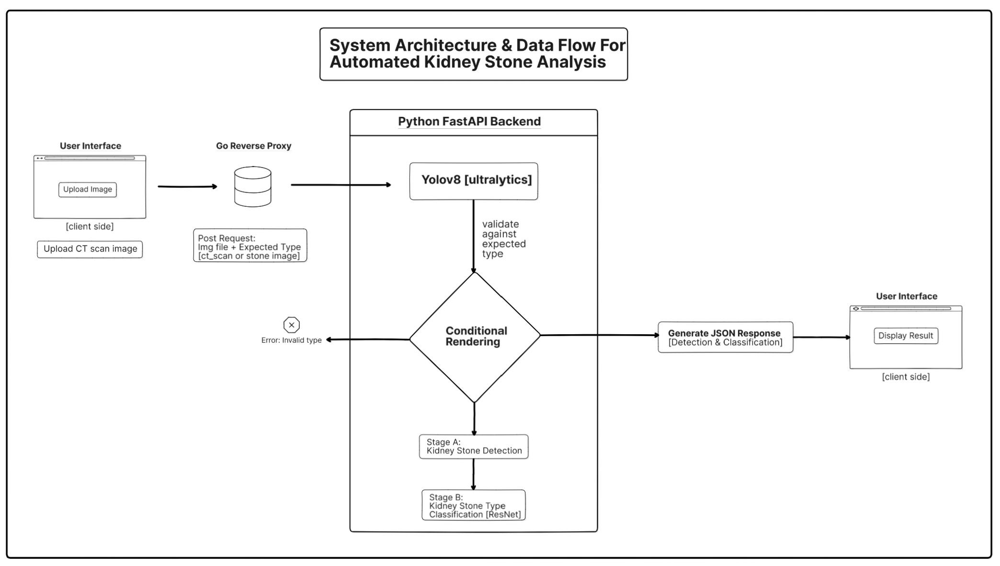

> **For a detailed explanation of the system architecture, models, and codebase, please see our [Full Project Documentation (DOCS.md)](DOCS.md).**



# Project

## To get started

1. Clone the repo
   ```
   git clone https://github.com/sampathvenur/Project.git
   cd Project
   ```
[python 3.12.10](https://www.python.org/downloads/release/python-31210/) 👈 Download and install python <br>
2. Install Python dependencies
   ```
   pip install -r requirements.txt
   ```


(Open two terminal sessions to run step 3 and step 4) <br>
3. Run the Python API
   ```
   python -m uvicorn api:app --reload
   ```
 [go](https://go.dev/doc/install) 👈 Download and install go <br>
4. Run the Go backend
   ```
   go run main.go
   ```


5. Open your browser and go to ```http://localhost:8080``` to access the web interface 